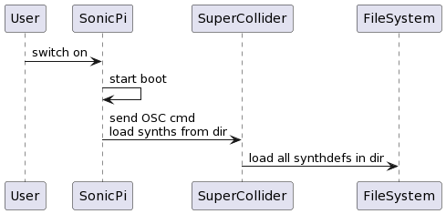

<!-- DO NOT EDIT - this file generated by the literate code reader -->
<!-- https://gordonguthrie.github.io/literatecodereader/ -->
# Chapter 3 - Deep dive

##

## How built-in synthdefs are loaded

Lets go hunting for the code that loads synth definitions and see what it does.

This is the boot sequence:



Using a combination of the logging techniques in the previous section we can soon find out roughly how it works.

The very earliest message we see in the GUI is:

```
=> Welcome to Sonic Pi v5.0.0-Tech Preview 2
```

This message is sent from the [runtime module](https://github.com/sonic-pi-net/sonic-pi/blob/dev/app/server/ruby/lib/sonicpi/runtime.rb#L558):

```ruby
  def __load_buffer(id)
      id = id.to_s
      raise "Aborting load: file name is blank" if  id.empty?
      path = File.expand_path("#{Paths.project_path}/#{id}.spi")
      s = "# Welcome to Sonic Pi\n\n"
      if File.exist? path
        s = IO.read(path)
      end
      __replace_buffer(id, s)
    end
```

That function `__load_buffer` is called in one place and one place only, by the [spider server](https://github.com/sonic-pi-net/sonic-pi/blob/dev/app/server/ruby/bin/spider-server.rb).

We know that the `spider-server` is special because it sits in `app/bin` and not `app/server/ruby/lib/sonicpi` like the rest of the ruby code.

Spider has its own log in `~/.sonci-pi/logs` and if we look at them we can figure out what's going on:

```
Sonic Pi Spider Server booting...
The time is 2023-03-26 13:02:47 +0100
Using primary protocol: udp
Detecting port numbers...
Ports: {:server_port=>37064, :gui_port=>37065, :scsynth_port=>37066, :scsynth_send_port=>37066, :osc_cues_port=>4560, :tau_port=>37067, :listen_to_tau_port=>37071}
Token: 520542600
Opening UDP Server to listen to GUI on port: 37064
Spider - Pulling in modules...
Spider - Starting Runtime Server
TauComms - Sending /ping to tau: 127.0.0.1:37067
TauComms - Receiving ack from tau
TauComms - connection established
studio - init
scsynth boot - Waiting for the SuperCollider Server to have booted...
scsynth boot - Sending /status to server: 127.0.0.1:37066
scsynth boot - Receiving ack from scsynth
scsynth boot - Server connection established
scsynth - clear!
scsynth - clear schedule 
scsynth - schedule cleared!
scsynth - group clear 0
scsynth - group clear 0 completed
Studio - Initialised SuperCollider Audio Server v3.11.2
Studio - Resetting server
Studio - Reset and setup groups and busses
Studio - Clearing scsynth
scsynth - clear schedule
scsynth - clear scsynth
scsynth - clear!
scsynth - clear schedule 
scsynth - schedule cleared!
scsynth - group clear 0
scsynth - group clear 0 completed
scsynth - cleared scsynth
scsynth - bus allocators reset
Studio - Allocating audio bus
Studio - Create Base Synth Groups
Studio - Starting mixer
Studio - Starting scope
Spider - Runtime Server Initialised
Spider - Registering incoming Spider Server API endpoints
Spider - Booted Successfully.
Spider - v5.0.0-Tech Preview 2, OS raspberry, on Ruby  2.7.4 | 2.7.0.
Spider - ------------------------------------------
```

It co-ordinates the dance with the Tau server that handles timing and events and the SuperCollider server which actually makes the sounds.

Somewhere in here it starts up the [sound module](https://github.com/sonic-pi-net/sonic-pi/blob/dev/app/server/ruby/lib/sonicpi/lang/sound.rb#L68) that actually starts the `studio`.

If we examine the `initialize` method of the class [Studio](https://github.com/sonic-pi-net/sonic-pi/blob/dev/app/server/ruby/lib/sonicpi/studio.rb#L25) and match what happens we can see how the synth definitions are loaded:

```ruby
    def initialize(ports, msg_queue, state, register_cue_event_lambda, current_spider_time_lambda)

      STDOUT.puts "studio - init"
      STDOUT.flush

      @state = state
      @scsynth_port = ports[:scsynth_port]
      @scsynth_send_port = ports[:scsynth_send_port]
      @msg_queue = msg_queue
      @error_occured_mutex = Mutex.new
      @error_occurred_since_last_check = false
      @sample_sem = Mutex.new
      @reboot_mutex = Mutex.new
      @rebooting = false
      @cent_tuning = 0
      @sample_format = "int16"
      @paused = false
      @register_cue_event_lambda = register_cue_event_lambda
      @current_spider_time_lambda = current_spider_time_lambda
      @global_timewarp = 0
      init_scsynth
      reset_server
      init_studio
    end
```

If we trace down the last three function invocations and match their log messages to those in the `spider.log` we can see this function setting everything up for the user - after the SuperCollider and Tau engines have both started.

The last function to run on creating a new Studio is [init_studio](https://github.com/sonic-pi-net/sonic-pi/blob/dev/app/server/ruby/lib/sonicpi/studio.rb#L72) and it loads the synthdefs:

```ruby
    def init_studio
      @server.load_synthdefs(Paths.synthdef_path)
      @amp = [0.0, 1.0]
      @server.add_event_handler("/sonic-pi/amp", "/sonic-pi/amp") do |payload|
        @amp = [payload[2], payload[3]]
      end
```

Actually it tells the [server](https://github.com/sonic-pi-net/sonic-pi/blob/dev/app/server/ruby/lib/sonicpi/server.rb#L155) to load them: which it does by sending an OSC message to SuperCollider:

```ruby
    def load_synthdefs(path)
      info "Loading synthdefs from path: #{path}" if @debug_mode
      with_done_sync [@osc_path_d_loaddir] do
        osc @osc_path_d_loaddir, path.to_s
      end
    end
```

The format of the message is an instruction to load code and a filepath - so at this stage Sonic Pi doesn't know anything more about the built in synthesisers other than their location `etc/synthdefs/compiled`.

If we pop a new compiled synthdef in here it will load on boot automatically.

